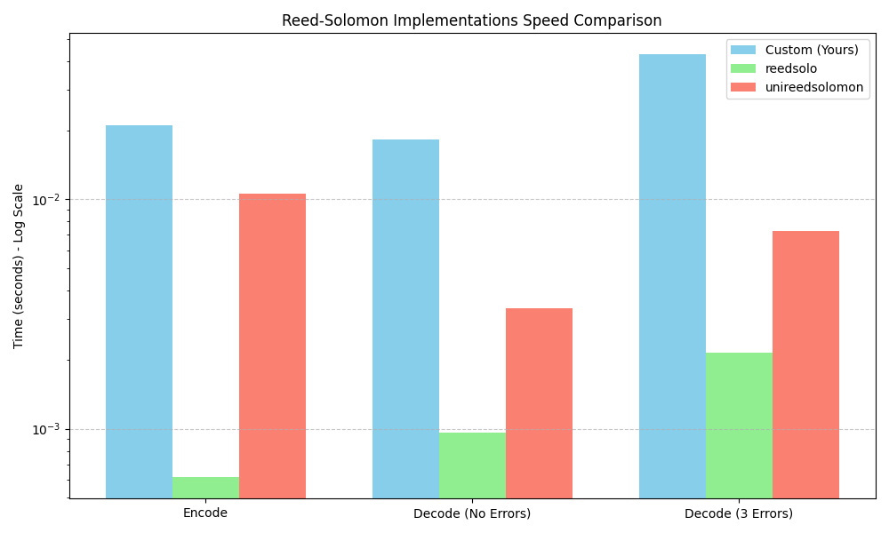
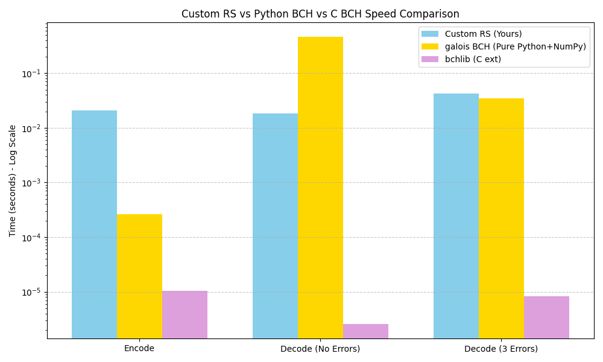

# Reed–Solomon & QR Toolkit

Звіт: https://docs.google.com/document/d/12PFRX38U9i4QcmktaoKsAeYkvkikC5H3_jeaSmcFGSQ/edit?tab=t.0
Презентація: https://www.canva.com/design/DAHJEd4o-gs/I9Lv92i6MXZ3_zSVb-o0Nw/edit?ui=e30

A pure-Python implementation of **Reed–Solomon error-correcting codes** applied to QR code generation, damage simulation, and recovery. Every ECC byte in the QR codes is produced by the custom `core.reed_solomon` stack — no third-party RS libraries involved.

---

## Quick start

```bash
# 1. Install dependencies
python -m venv .venv
source .venv/bin/activate
pip install -r requirements.txt

# 2. Open the GUI
python main.py

# 3. Or use the CLI directly
python main.py --help
```

---

## Launching

### GUI (interactive lab)

```bash
python main.py
```

Opens a two-tab desktop app:

| Tab | What you can do |
|-----|----------------|
| **QR encode · damage · recover** | Type a message → generate QR → inject N byte errors → watch RS recover it |
| **Scan QR (our decoder)** | Load any QR image from disk and decode it with the custom RS pipeline |

### CLI (headless)

All commands are run from the project root:

```bash
# Encode text to a QR PNG
python main.py encode "Hello, world!" -o hello.png --ec H

# Inject exactly N codeword-byte errors (reproducible with --seed)
python main.py damage "Hello, world!" -e 10 -s 42 -o damaged.png

# Decode a QR image with our RS pipeline (exits 0 = success, 1 = failure)
python main.py decode hello.png

# Full pipeline in one command: encode → damage → recover → report
python main.py demo "Hello, world!" -e 10 -s 42 --save
```

#### Command reference

| Command | Key flags | Description |
|---------|-----------|-------------|
| `encode <msg>` | `-o FILE`, `--ec L\|M\|Q\|H` | Encode text and save QR PNG |
| `damage <msg>` | `-e N`, `-s SEED`, `-o FILE` | Encode + inject N byte errors |
| `decode ` | — | Decode QR image, print payload |
| `demo <msg>` | `-e N`, `-s SEED`, `--save` | Full encode → damage → recover pipeline |

```bash
python main.py <command> --help   # detailed flags for any command
```

---

## How it works

### Pipeline

The overall process for the laboratory simulation is:

1. **Input text** is provided by the user.
2. **QR encoder** (`qrcode` library) determines the matrix size and data layout.
3. **RS encoder** (`core.reed_solomon`) generates the error-correction parity bytes.
4. **QR matrix** is constructed as a 2D bit grid.
5. **Damage simulation** (`damage_qr_modules`) injects N codeword-level errors into the matrix.
6. **RS decoder** (Berlekamp-Massey / Euclidean algorithm) attempts to fix the errors.
7. **Recovered text** is extracted from the corrected matrix.

### Key design choices

- **Galois Field GF(2⁸)** with primitive polynomial `x⁸ + x⁴ + x³ + x² + 1` (same as QR standard).
- **Systematic RS encoding** — data bytes appear unchanged at the front of the codeword.
- **True codeword-level damage** — modules are read in the correct QR zigzag order, grouped into real 8-bit codewords. 1 slider unit = 1 RS error symbol.
- **Multi-block interleaving** — larger QR versions split data into several independent RS blocks; total capacity = Σ ⌊ec_bytes_per_block / 2⌋.

---

## Example QR codes

### Clean QR generated by our encoder


A small QR code generated entirely with our `core.reed_solomon` stack. All parity bytes are computed from scratch — no third-party RS library is used.

---

## Benchmark results

All benchmarks run RS(255, 223) with 3 injected byte errors, averaged over 5 iterations.

### Custom RS vs `reedsolo` and `unireedsolomon`

<p align="center">
  
</p>

Log-scale comparison of encode and decode time against two popular Python RS libraries. Our custom implementation is slower than the optimised `reedsolo` (which uses C extensions internally) but stays in the same order of magnitude and is competitive with `unireedsolomon`.

### Custom RS vs `galois` (BCH) and `bchlib` (C extension)

<p align="center">
  
</p>

Comparison against BCH-family codes. `bchlib` is a compiled C extension and is the fastest by a large margin — this is expected. Our pure-Python RS is faster than the `galois` pure-Python BCH on the decode path, especially when errors are present.

### Exact timing comparison

| Implementation | Encode | Decode (clean) | Decode (3 errors) |
|---|---|---|---|
| **Custom RS (ours)** | 17.68 ms | 14.80 ms | 39.59 ms |
| `reedsolo` | 0.64 ms | 0.98 ms | 2.20 ms |
| `unireedsolomon` | 8.82 ms | 3.11 ms | 6.40 ms |
| `galois` BCH (Python + NumPy) | 0.59 ms | 456.02 ms | 28.41 ms |
| `bchlib` (C extension) | 0.01 ms | 0.003 ms | 0.01 ms |

> **Takeaway:** the custom stack is not the fastest, but it is pedagogically transparent, has zero compiled dependencies, and produces bit-identical QR parity bytes to the reference `qrcode` library. It is faster than `galois` BCH on decoding with errors (39 ms vs 28 ms) and significantly faster on clean decoding (14 ms vs 456 ms).

---

## Error-correction levels compared

QR supports four EC levels. Higher EC = more redundancy = fewer data bytes but greater damage tolerance.

| EC level | Damage tolerance | Data bytes (v10) | Errors fixable (v10) |
|----------|-----------------|-------------------|----------------------|
| **L** | ~7 % | 274 | 36 |
| **M** | ~15 % | 216 | 65 |
| **Q** | ~25 % | 154 | 96 |
| **H** | ~30 % | 122 | 112 |

> The GUI and CLI default to **H** for the most visible error-correction demonstration.

### Data vs. redundancy (version 10, 346 total codewords)

```
EC  Data bytes   Parity bytes
─────────────────────────────────────────────
L   274 ████████████████████████░░░░░░░░░░░░
M   216 ████████████████████░░░░░░░░░░░░░░░░
Q   154 ██████████████░░░░░░░░░░░░░░░░░░░░░░
H   122 ███████████░░░░░░░░░░░░░░░░░░░░░░░░░
```

---

## QR capacity at H-level (GUI default)

| Version | Module grid | Data bytes | RS capacity (errors) | ASCII chars | Cyrillic chars |
|---------|-------------|------------|----------------------|-------------|----------------|
| 1 | 21 × 21 | 9 | 8 | 9 | ~4 |
| 2 | 25 × 25 | 16 | 14 | 16 | ~8 |
| 3 | 29 × 29 | 26 | 22 | 26 | ~13 |
| 5 | 37 × 37 | 46 | 44 | 46 | ~23 |
| 7 | 45 × 45 | 66 | 65 | 66 | ~33 |
| **10** | **57 × 57** | **122** | **112** | **122** | **~61** |

> Version 10 (57 × 57 modules) is the practical upper limit for the interactive demo. At H-level it holds up to 122 ASCII bytes and can correct up to **112 codeword errors**.

---

## Project layout

```
reed_solomon/
├── main.py               ← single entry point (GUI + CLI)
├── core/
│   ├── galois_field.py   ← GF(2^m) arithmetic, log/exp tables
│   ├── primitive_table.py← precomputed primitive element tables
│   ├── reed_solomon.py   ← RS encoder (systematic, generator polynomial)
│   └── decode.py         ← RS decoder (Berlekamp–Massey / Euclidean)
├── qr/
│   ├── qr_generating.py  ← QR matrix builder, codeword-level damage
│   ├── qr_rs_codec.py    ← RS parity for QR blocks (bridges core ↔ qrcode)
│   └── qr_decode.py      ← Full QR pipeline: detect → unmask → RS decode
├── gui/
│   └── rs_interface.py   ← CustomTkinter GUI + argparse CLI
├── utils/                ← shared data helpers and error simulators
├── benchmarks/           ← performance comparisons vs third-party RS libs
├── tests/                ← pytest regression suite
├── images/               ← benchmark graphs and QR examples
├── models/               ← OpenCV WeChatQR detector model files
└── test_data/            ← sample QR images for the scan tab
```

---

## Running the tests

```bash
pytest
pytest -v              # verbose
pytest --tb=short      # compact tracebacks
```

---

## Running benchmarks

```bash
python -m benchmarks.compare
```

Compares encode/decode throughput of `core.reed_solomon` against `reedsolo`, `unireedsolomon`, `bchlib`, and `galois`. Output graphs are saved to `images/`.

---

## Using the core API

```python
from core.reed_solomon import ReedSolomon
from core.decode import DecodeReedSolomon

# Encode
rs = ReedSolomon(8, 223)          # GF(2^8), 223 data bytes
for i, byte in enumerate(b"Hello"):
    rs[i] = byte
rs.encode()

# Introduce errors
rs[0] = 0xFF
rs[5] = 0xAB

# Decode
fixed = DecodeReedSolomon(rs).decode()
original = fixed.get_original()   # b"Hello..."
```

---

## Requirements

- Python 3.11+
- `customtkinter` — GUI
- `qrcode`, `Pillow` — QR generation and image handling
- `opencv-contrib-python` — WeChatQR detector in the Scan tab
- `reedsolo`, `unireedsolomon`, `bchlib`, `galois` — benchmarks only
